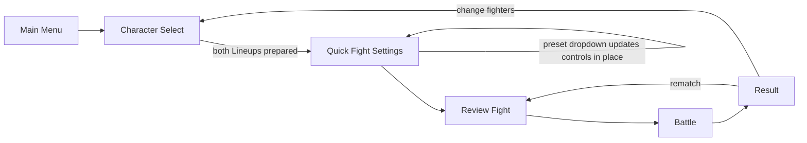
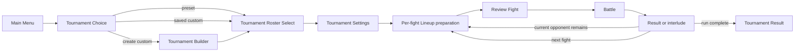
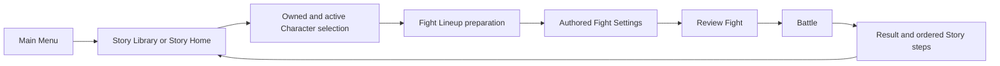
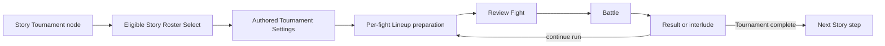
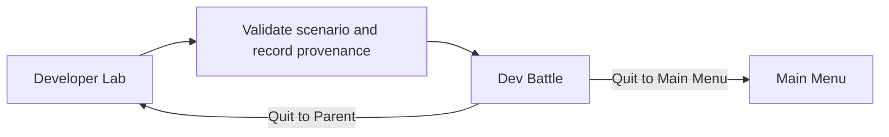

# LOFTWAH FIGHTER match-launch flows

Status: **ACCEPTED PRODUCT AND ARCHITECTURE CONTRACT**

This document makes the route through Character selection, Lineup preparation,
Fight Settings, Review Fight, and Battle explicit for every mode. It is a
focused companion to [game design](game-design.md),
[technical design](technical-design.md), and the
[view inventory](view-inventory.md). Those documents remain authoritative for
rules, architecture, and implementation status respectively.

## Shared language

- **Character Select** chooses the eligible Character instances or long-lived
  Roster available to a fight. It is visual, paginated, supports duplicate
  instances when the mode permits them, and does not use native Character
  dropdowns.
- **Lineup preparation** chooses one to three deployed fighters, their order,
  the starter, and the team Accessory. An Accessory belongs to its Lineup, not
  to Fight Settings.
- **Fight Settings** owns encounter rules such as difficulty, clock, opening
  Charge, deterministic seed, and any sandbox build controls permitted by the
  mode. It may show Lineup-derived values as read-only context.
- **Review Fight** is the shared, read-only confirmation immediately before
  Battle. It shows the exact resolved Lineups, Accessories, builds, rules, and
  provenance that Battle will receive.
- **Parent** means the owning mode's nearest safe context, not a generic browser
  history step. Every non-Battle view exposes both `Parent` and `Main Menu`.
  When Parent already is Main Menu, one clearly labelled Main Menu action
  satisfies both destinations.

There is no player-facing route that starts Battle directly. Presets are
values, not pages.

## Quick Fight

| Stage                | Player chooses                                                                 | Inherited or supplied                                             | Locked or unavailable                         | Parent                           |
| -------------------- | ------------------------------------------------------------------------------ | ----------------------------------------------------------------- | --------------------------------------------- | -------------------------------- |
| Character Select     | Both one-to-three-fighter Lineups, order, starter, and each Lineup's Accessory | Full sandbox catalogue and the last useful draft, when available  | Story ownership and unlock rules do not apply | Main Menu                        |
| Quick Fight Settings | Compact preset, difficulty, clock, opening Charge, seed, and supported builds  | Preferred global difficulty initialises a new draft               | Nothing outside supported combat rules        | Character Select                 |
| Review Fight         | Confirm or return to edit                                                      | Exact resolved Lineups, Accessories, builds, rules and provenance | All match values are read-only                | Quick Fight Settings             |
| Battle               | Battle commands                                                                | Confirmed immutable match configuration                           | Setup editing                                 | Review Fight through Pause       |
| Result               | Rematch, change fighters, or leave                                             | Deterministic Battle Report                                       | Story and Tournament rewards                  | Review Fight or Character Select |

The preset is one compact selector inside Quick Fight Settings. Choosing a
preset updates every related visible control without navigating away. Editing
an affected value makes the draft `Custom`; Custom is a state, not a separate
screen.

The default preset is **Full Power**: the highest supported Character level,
all available stat points assigned through a balanced baseline, and every Move
at the highest supported tier. It is designed to be immediately entertaining,
not to expose a calibration fixture. **Hot Start** applies faster opening
conditions on top of that baseline. The settings surface shows exact values,
while player-facing preset copy describes how the fight feels.

## Standalone Tournament

| Stage                        | Player chooses                                                                         | Inherited or supplied                                                    | Locked or unavailable                                               | Parent                        |
| ---------------------------- | -------------------------------------------------------------------------------------- | ------------------------------------------------------------------------ | ------------------------------------------------------------------- | ----------------------------- |
| Tournament Choice            | Preset, saved custom Tournament, resume, or create custom                              | Registered Trophy and definition identity                                | A Tournament cannot exist without a Trophy                          | Main Menu                     |
| Tournament Builder           | Name, generic Trophy, opponent Squads, ordered nodes, defaults and per-fight overrides | Registered Characters, rules, effects, and generic Trophies              | Story-only ownership/progression                                    | Tournament Choice             |
| Tournament Roster Select     | Up to six sandbox Character instances, their builds, and Roster order                  | Chosen Tournament definition                                             | Roster snapshot after entry                                         | Tournament Choice             |
| Tournament Settings          | Global defaults plus explicit per-fight overrides                                      | Preset values or saved custom definition                                 | Editing a preset creates a custom variant; it never mutates content | Tournament Roster Select      |
| Per-fight Lineup preparation | One to three living Roster members, order, starter, and available Lineup Accessory     | Persistent Health/defeat state, pending effects, authored opponent       | Opponent Squad and exhausted Accessories                            | Tournament lobby/current node |
| Review Fight                 | Confirm or return to Lineup preparation/settings                                       | Exact resolved deployment, carried Health, Accessory and effective rules | All match values are read-only                                      | Per-fight Lineup preparation  |
| Battle                       | Battle commands                                                                        | Confirmed immutable match configuration                                  | Roster and settings editing                                         | Current round through Pause   |

A preset Tournament is an immutable authored definition. Standalone play may
use it as-is or create a custom variant when the player changes global defaults
or a fight override. The local custom Tournament builder is scheduled for V2.1;
V2 architecture and the representative Tournament must already use the same
definition, override, resolution, and Review Fight boundaries.

Quitting a Tournament Battle to Parent must not silently restore an earlier
Health snapshot. The confirmation names the consequence, records the current
deployment outcome required by Tournament rules, and returns to the current
round. `Forfeit Tournament` remains a separate action that ends the run.

## Story fight

| Stage                                | Player chooses                                                                      | Inherited or supplied                                             | Locked or unavailable                       | Parent                         |
| ------------------------------------ | ----------------------------------------------------------------------------------- | ----------------------------------------------------------------- | ------------------------------------------- | ------------------------------ |
| Story Library or Story Home          | Story Save, resume/replay, or next available node                                   | Story definition and persisted progress                           | Other Story Saves' progression              | Main Menu                      |
| Owned and active Character selection | Up to six active Story-owned or explicitly loaned instances                         | Collection, levels, builds, Modifications and ownership           | Unowned Characters unless explicitly loaned | Story Home                     |
| Fight Lineup preparation             | One to three eligible active Squad members, order, starter, and available Accessory | Story-owned builds and authored opponent                          | Opponent selection and disallowed equipment | Story node/Character selection |
| Authored Fight Settings              | Only values the Story explicitly permits, commonly difficulty                       | Encounter rules, opponent build, rewards and presentation         | Authored values are visible and read-only   | Fight Lineup preparation       |
| Review Fight                         | Confirm or return                                                                   | Exact resolved Lineups, Accessories, builds, rules and provenance | All match values are read-only              | Authored Fight Settings        |
| Battle                               | Battle commands                                                                     | Confirmed immutable match configuration                           | Setup editing                               | Story node through Pause       |

An authored settings stage may be visually compact when every value is locked,
but its information is not omitted. Difficulty stays forgiving: Story progress
is never gated or punished because the player changed it.

## Tournament inside Story

The common Tournament runner is reused. Story supplies the preset Tournament
definition, the eligible Story-owned or loaned instances, their builds, and the
Story Save that owns local consequences. The player cannot replace the authored
Tournament or edit its definition. They still choose the eligible Roster at
entry and the living Lineup, order, starter, and available Accessory before each
fight. Review Fight and the resolved match contract remain shared with every
other mode.

## Developer Lab

Developer Lab may bypass the visible authoring and Review Fight stages for
speed. It must still construct the same resolved match configuration, validate
all content and rules before arena construction, record every override and the
scenario identity as provenance, and classify the report as development-only.
It cannot grant progression, rewards, Achievements, or Tournament consequences.

## Choice and ownership matrix

| Match datum               | Quick Fight                                | Standalone Tournament                                      | Story fight                                              | Story Tournament                                        | Developer Lab                            |
| ------------------------- | ------------------------------------------ | ---------------------------------------------------------- | -------------------------------------------------------- | ------------------------------------------------------- | ---------------------------------------- |
| Mode/provenance           | Chosen by entering Quick Fight             | Tournament definition and run                              | Story Save and encounter                                 | Story Save plus preset Tournament                       | Named scenario plus explicit overrides   |
| Eligible Character pool   | Entire catalogue                           | Entire sandbox catalogue                                   | Story-owned and explicit loans                           | Story-owned and explicit loans                          | Scenario-defined                         |
| Long-lived Roster         | None                                       | Player chooses up to six, then it locks                    | Active Story Squad up to six                             | Player confirms eligible Story Roster, then it locks    | None unless scenario models one          |
| Deployed Lineup           | Player chooses both sides                  | Player chooses living members; Tournament owns opponent    | Player chooses active Squad members; Story owns opponent | Player chooses living members; Tournament owns opponent | Scenario-defined or Lab-selected         |
| Order and starter         | Player chooses both sides                  | Player chooses their side; opponent is authored            | Player chooses their side; opponent is authored          | Player chooses their side; opponent is authored         | Scenario-defined or Lab-selected         |
| Accessory                 | Chosen with each Lineup                    | Chosen with deployment; availability may persist/exhaust   | Chosen from Story-owned eligible equipment               | Chosen from Story-owned eligible equipment; may exhaust | Scenario-defined                         |
| Character builds          | Fully configurable sandbox builds          | Configured before Roster lock; then persistent             | Story-owned or authored-loan builds                      | Story-owned or authored-loan builds; locked for run     | Explicit overrides                       |
| Difficulty                | Quick setting, initialised from preference | Tournament default with optional per-fight override        | Preferred difficulty unless encounter constrains it      | Authored Tournament value under forgiving Story policy  | Explicit override                        |
| Clock/opening Charge/seed | Preset or Custom values                    | Definition default plus per-fight override and run effects | Authored encounter values                                | Authored Tournament values plus run effects             | Explicit override                        |
| Opponent                  | Player chooses                             | Tournament fight definition                                | Story encounter                                          | Tournament fight definition                             | Scenario-defined                         |
| Review Fight              | Required                                   | Required per fight                                         | Required                                                 | Required per fight                                      | May be bypassed visibly, never logically |

## Navigation and quitting contract

- Every non-Battle screen exposes a clear Parent action and a Main Menu action.
  They may be buttons or labelled icons, but neither destination may depend on
  an unexplained logo, browser Back, or hidden gesture.
- Parent preserves the valid draft or run state owned by that mode. Main Menu
  leaves the mode without deleting a Story Save, Tournament run, or reusable
  Quick draft unless the player explicitly discards it.
- Battle Pause exposes `Resume`, `Quit Fight to Parent`, and
  `Quit to Main Menu`. Both quit actions require confirmation when leaving would discard a
  live fight or apply a Tournament consequence.
- `Quit Fight to Parent` returns to the owning mode's safe preparation context:
  Quick Review Fight, the Story node/preparation context, the current
  Tournament round, or Developer Lab.
- `Quit to Main Menu` performs the same required mode consequence and then
  returns to Main Menu. It is never a shortcut around Tournament persistence or
  Story result rules.
- Restart remains a separate Battle action. Forfeit remains a separate
  Tournament-run action.

## Current implementation alignment

Quick Fight now conforms to the accepted launch flow: it enters Character
Select directly, Lineups own their visual Accessory choices, Full Power is the
default build, the one preset selector updates Settings in place, and Review
Fight passes one immutable resolved configuration into Battle.

The remaining cross-mode work is explicit:

- The route manifest currently models several setup stages as substates of a
  coarse mode route. That is acceptable only if Parent/Main Menu behaviour and
  stage transitions remain explicit, exhaustive, and tested.
- Story and Tournament selection/settings/review adapters remain partial. They
  must converge on this shared contract without creating another combat engine.
- The custom Tournament builder remains a V2.1 view, while its definition and
  per-fight override seams remain part of the architecture now.

Implementation status is maintained in [view inventory](view-inventory.md),
not inferred from these accepted diagrams.
