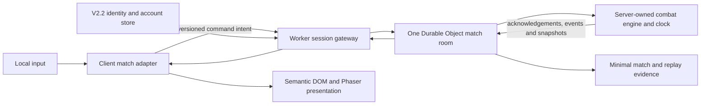

# LOFTWAH FIGHTER multiplayer seam

Status: **V2.4 DEFERRED ARCHITECTURE CONTRACT — DO NOT IMPLEMENT EARLY**

This document records how multiplayer can be added without making V2–V2.3 pay
its runtime, backend, product, security, or operational cost. The
[release roadmap](release-roadmap.md) owns milestone scope and
[technical design](technical-design.md) owns current architecture.

## Decision

Multiplayer belongs to V2.4, the last currently planned feature milestone.
Earlier releases keep the combat domain deterministic and transport-neutral,
but do not add remote controllers, matchmaking, sockets, match rooms, online
rewards, or speculative Cloudflare services.

This is deliberate. A network fight is not a second UI controller. It adds
identity, session authority, protocol compatibility, server timing, reconnect,
desynchronisation recovery, reward trust, cheating resistance, privacy,
moderation, capacity, cost, observability, incident response, and ongoing
operations.

## Reusable seams that already exist

The current code provides useful foundations:

- `src/combat/` has no Phaser or Cloudflare dependency;
- every battle has an explicit seed and deterministic RNG streams;
- `BattleCommand` is a small serialisable union for Move, switch, Accessory,
  pickup, and forfeit intent;
- domain requests accept an explicit `Side` rather than assuming the local
  player is always the actor;
- controller ownership sits in the application layer;
- accepted decisions, exact simulation deltas, events, participants, and
  outcome are recorded in a versioned `BattleReport`;
- `src/combat/replay.ts` can reapply timestamped side-agnostic commands and
  verify deterministic results;
- Phaser consumes state and semantic events but does not decide outcomes.

These seams reduce future rework. They do not make multiplayer small.

## Boundary to add in V2.4

The server owns the match seed, locked content/build snapshot, side assignment,
clock, command order, validation, state, outcome, and reward eligibility. A
client submits intent and renders authoritative responses. It never submits a
trusted result, damage value, elapsed time, reward, or replacement snapshot.

## Protocol envelope

The exact schema is ratified in V2.4, but it must include:

- protocol, engine, content, and match-rules versions;
- match ID and authenticated seat;
- monotonically increasing client command ID;
- last acknowledged server sequence;
- the serialisable `BattleCommand`;
- server receipt and authoritative simulation time;
- accepted/rejected acknowledgement with a reason code;
- ordered semantic events;
- authoritative state hash and periodic recovery snapshot;
- terminal outcome and signed result reference.

Commands are idempotent. Duplicate and out-of-order messages cannot apply an
action twice. Incompatible versions fail before ready state rather than
desynchronising during a fight.

## The important unresolved timing seam

Single-player countdown and Move-presentation locks currently live in the
application controller and freeze local simulation while Kinetic Panel Motion
plays. Multiplayer cannot trust two clients to freeze and resume at the same
moment.

Before V2.4 implementation, choose and test one orchestration rule:

1. the authoritative match room owns shared deterministic decision/presentation
   gates whose durations are derived from semantic events; or
2. server simulation continues independently while each client presents a
   buffered delayed view.

The first is closer to current game feel. The second may reduce network idle
time but changes how players read and answer Moves. Neither is adopted until a
two-client latency prototype proves the feel. Phaser still does not enter the
server or combat domain.

## Cloudflare adapter

The intended implementation is:

- a Worker gateway for authenticated session and match requests;
- one Durable Object per active match for single-threaded authoritative
  coordination;
- WebSocket Hibernation where compatible with the chosen timing rule;
- the V2.2 account store for identity and durable match metadata;
- Durable Object storage only for bounded recovery/replay evidence;
- explicit CPU, message, storage, retention, and cost budgets.

Cloudflare documents Durable Objects as coordinators for multiplayer clients
over WebSockets. Its Hibernation API can keep clients connected while an idle
Object leaves memory, but in-memory state is reset and must be recoverable:
<https://developers.cloudflare.com/durable-objects/best-practices/websockets/>.
Pricing counts Durable Object messages, active duration, and storage, so cost
modelling and message batching are release requirements rather than later
optimisations:
<https://developers.cloudflare.com/workers/platform/pricing/>.

## Delivery ladder

Do not jump directly to public matchmaking.

1. **Seam preservation, V2–V2.3:** keep deterministic replay, serialisable
   commands, explicit seeds, pure domain boundaries, and versioned saves.
2. **Local coordinator prototype:** run two browser clients against an
   in-process authoritative coordinator with simulated delay, loss, duplication,
   and reordering. No Cloudflare and no progression rewards.
3. **Private Cloudflare prototype:** replace only the coordinator adapter with a
   Worker/Durable Object private match room. Prove version negotiation, ready
   state, reconnect, forfeit, replay, and shutdown.
4. **Authenticated friend matches:** integrate V2.2 identity, staged persistence,
   support evidence, rate limits, and an emergency disable switch.
5. **Public matchmaking:** add discovery, ranking if approved, abuse handling,
   capacity evidence, cost alarms, rollback, and incident procedures.

Each step must preserve deterministic offline tests and can be abandoned
without changing combat rules.

## Required failure tests

- delayed, dropped, duplicated, and out-of-order messages;
- two commands arriving for the same decision boundary;
- reconnect before, during, and after a committed Move;
- hibernation/restart with recoverable state;
- client refresh, backgrounding, version skew, and content mismatch;
- invalid action, forged side, replayed command ID, and impossible timing;
- server deployment or runtime restart during a match;
- deliberate disconnect, timeout, forfeit, and no-show;
- state-hash mismatch and authoritative snapshot recovery;
- match completion with reward persistence failure;
- backend outage while local modes continue normally.

## Decisions intentionally deferred to V2.4

- real-time versus asynchronous rules;
- private-match and public-match launch order beyond the required ladder;
- regions and latency budget;
- whether a match can pause;
- disconnect grace and winner policy;
- ranked/unranked queues and rating system;
- rematch and spectator behaviour;
- communication features and associated moderation;
- online rewards;
- replay visibility and retention;
- seasonal balance policy;
- cost ceiling and initial capacity.

Until those decisions are accepted, V2 work must not introduce a `remote`
controller kind or network-aware combat branch.
