# Standalone Tournament V2 implementation audit

Status: implementation evidence for the first complete preset Tournament path.

Captured before implementation on 2026-08-07 at `1920 × 1080` and
`390 × 844`.

## Current versus required flow

```mermaid
flowchart TB
  subgraph Current["Current implementation before this package"]
    C1["Main Menu"] --> C2["Wrong Door Cup lobby"]
    C2 --> C3["Combined fixed Roster + deployment"]
    C3 --> C4["Shared Review Fight"]
    C4 --> C5["Battle"]
    C5 --> C6["Shared Battle Result"]
    C6 -->|"win"| C7["Hard-coded recovery choice"]
    C6 -->|"loss with reserves"| C3
  end

  subgraph Required["Required complete preset path"]
    R1["Main Menu"] --> R2["Tournament Choice"]
    R2 -->|"new preset run"| R3["Tournament Roster Select"]
    R2 -->|"unfinished run"| R5["Per-fight Lineup preparation"]
    R3 --> R4["Tournament Settings"]
    R4 --> R5
    R5 --> R6["Shared Review Fight"]
    R6 --> R7["Battle"]
    R7 --> R8["Deployment Result or interlude"]
    R8 -->|"same damaged opponent"| R5
    R8 -->|"next fight"| R5
    R8 -->|"terminal"| R9["Tournament Result"]
  end
```

## Audit findings

### Real and reusable

- The registered Wrong Door Cup definition owns stable Tournament, Trophy,
  arena, round, seed and opponent identities.
- The existing runner locks no more than six unique instances, validates living
  deployments, preserves both sides' Health for an unfinished opponent, tracks
  exhausted Accessories, supports the three existing recovery choices and
  de-duplicates the Trophy award.
- The application already resolves Tournament fights through the shared
  immutable match configuration, shared Review Fight and shared Battle.
- The live lobby uses registered arena, Trophy and Character assets and exposes
  semantic deployment and starter controls.

### Partial

- Main Menu enters the Wrong Door Cup lobby directly. There is no Tournament
  Choice, explicit Roster Select or Tournament Settings stage.
- The lobby combines Tournament identity, bracket, Trophy, current Lineups,
  opponent preview, six-member Roster and per-fight deployment into one long
  surface.
- The first standalone run is pre-filled with all six launch Characters using
  fixed Standard Builds. The complete sandbox catalogue and duplicate-instance
  roster configuration are not exposed.
- The current shared Review Fight shows carried Health as explanatory status,
  but the battle controller restores Health after creating combat state instead
  of carrying it in the reviewed immutable match snapshot.
- A lost deployment with reserves correctly returns to the same opponent, but
  the result is still the shared battle result rather than an explicit
  deployment-result contract.

### Duplicated or hard-coded

- General runtime paths name `cheapSeats`, fixed three-round indices, fixed
  opponent instance IDs, fixed player roster IDs, fixed recovery IDs and the
  Wrong Door Cup result copy.
- Tournament `rounds` and ordered `nodes` duplicate fight data.
- The application controller constructs opponent builds, applies the fixed
  player Accessory and interprets recovery progression instead of calling one
  definition-generic Tournament match/runner seam.
- Tournament Settings data includes a player Accessory even though Accessory
  ownership belongs to per-fight Lineup preparation.

## Baseline captures and concepts

- `output/playwright/tournament-before/choice-1920x1080.png`
- `output/playwright/tournament-before/choice-390x844.png`
- `.impeccable/mocks/tournament-choice/requirements-led.png`
- `.impeccable/mocks/tournament-choice/live-led-approved.png`

The live-screenshot-led concept is selected. It retains the real arena,
Trophy, bracket, palette and game chrome while separating Tournament choice
from later Roster and deployment decisions.

## Implemented evidence

- Choice: `output/playwright/tournament-final/choice-1920x1080.png` and
  `choice-390x844.png`.
- Roster and complete paginated sandbox catalogue:
  `output/playwright/tournament-final/roster-1920x1080.png` and
  `roster-390x844-final.png`.
- Settings and explicit fight overrides:
  `output/playwright/tournament-final/settings-1920x1080.png`.
- Bounded deployment with stable navigation and confirmation:
  `output/playwright/tournament-final/deployment-bounded-1920x1080.png` and
  `deployment-bounded-390x844-final.png`.
- Shared immutable Review Fight:
  `output/playwright/tournament-final/review-1920x1080.png`.

Browser measurements report exact document bounds at both required sizes,
visible deployment confirmation actions and zero console errors. A persisted
custom run variant was resumed and reached Review Fight with Brutal difficulty
and its Fight 1 clock override resolved to 60 seconds.
